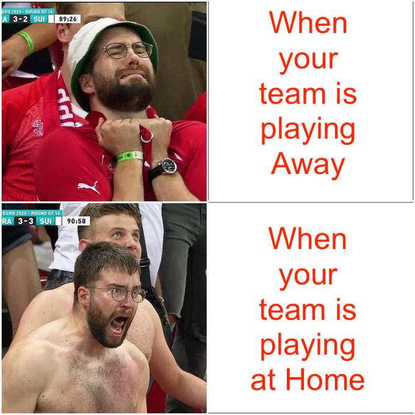
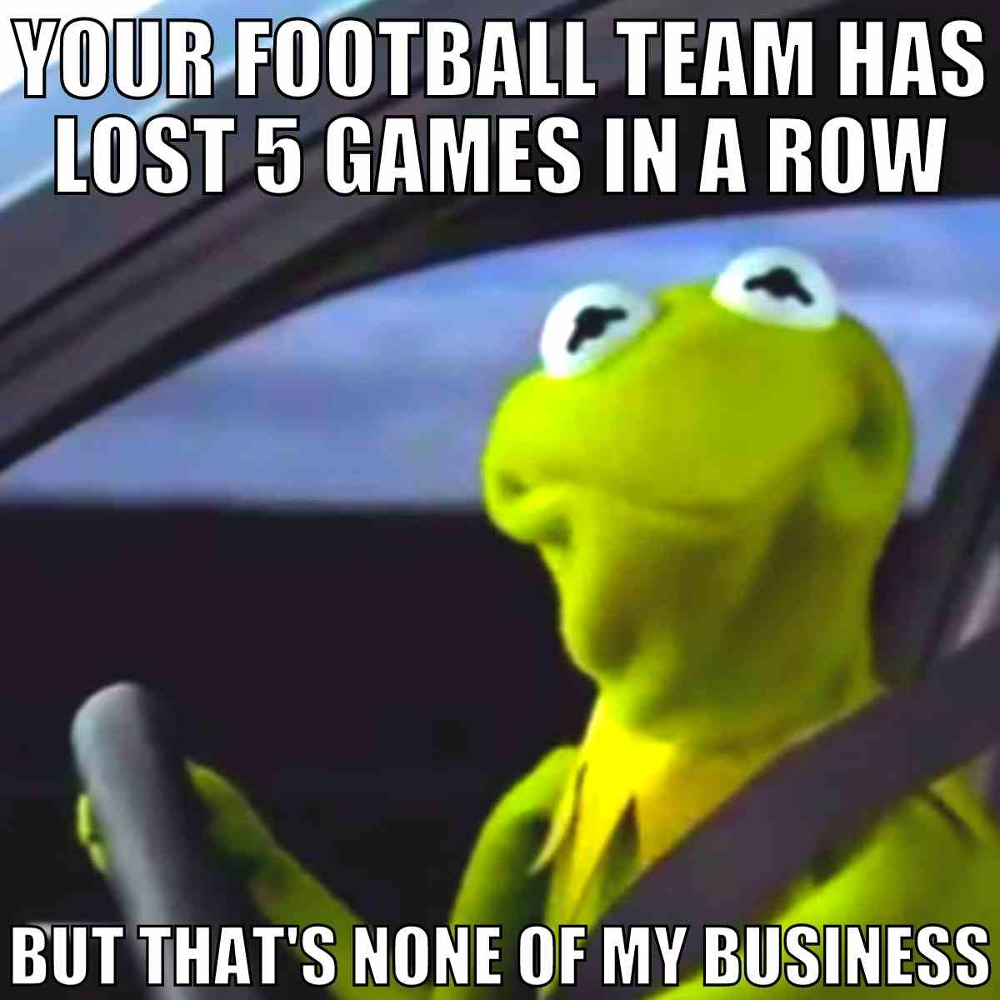

```{r setup, include=FALSE}
knitr::opts_chunk$set(echo = TRUE)
library(knitr)
library(tidyverse)
library(dplyr)
library(ggplot2)
library(emojifont)
library(readxl)
library(ggpubr)
library(readr)
library(corrplot)
library(wordcloud)
library(RColorBrewer)
library(wordcloud2)
library(tm)
library(wesanderson)
Ref <- read_csv("Ref.bib")
spec(Ref)
```


```{css, echo=FALSE}
h1, h4 {
  text-align: center;
  color: darkblue;
  font-weight: bold;
}
```
```{css, echo=FALSE}
h2 {
  text-align:  justify   ;
  color: blue;
  font-weight: bold;
}
```

<div align="center">



\newpage

# Where it all starts


## *13 reasons why*... but make it 2


Not knowing how to initiate my report, (as it happens most of the time
with school essays), I thought that telling you why I chose the topic I
did could be a good starting point. Well, before explaining to you why
maybe I should start with what. In this report, you will follow the path
I took aiming to see if football (or soccer depending on where you are
from) teams win more games when playing at home or away. As a big
football fan, I am pleased to be able to work on a topic that is
interesting and fascinating to me. I guess that's the main reason I
picked this topic. Searching for football data, I discovered there were
lots of choices, there is data on players, games, countries, goals
scored, and so on. As I often go to see Servette football games when
they are playing at home but also away, I wonder if the probabilities of
seeing them win would be different in each case. I guess those are the
two main reasons I decided to go in the direction I did, and found my
research question. Indeed, I wonder if football teams win more at home
or away.

<div align="center">


## Adventuring into Data Collection


As I mentioned below, there is a lot of data revolving around the
football world. When I stumbled across the website [Football
Data](https://www.football-data.co.uk) I was at first a bit reluctant as
it looks more like a betting page than anything else and is fill with
advertising of different betting houses.

<div align="center">


I don't think I was totally wrong, but I must admit their data sets on
football are pretty complete, with lots of information and have data
from a lot of countries. After thinking a bit more about what I wanted
to do, I finally decided to focus my research on
[Switzerland](https://www.football-data.co.uk/switzerland.php), to be
more precise on the Super League championship. I found a complete data
set that listed all the football games played in the Swiss Super League
from 2012 up to now. I was glad to find that the data was updated every
week. Before dowloading it, I decided to wait until the 13th of November
2022, which is when the winter football break started, and meant no more
games until 2023. By doing so I now have an up-to-date data set and I am
ready to start exploring it (plus to be fair I wouldn't have started
before, I am more of a kind of last-minute and no-sleep-nights person).


{width="50%"}

```{r}
DataBase_OnFootballScores <- read_excel("DataBase_OnFootballScores.xlsx")
DBF<-DataBase_OnFootballScores
```


## Exploring my data


I started by doing a table of both the games played at Home and those
played Away with the function table so I could visualize a bit more my
data.I also added a "word cloud" because I thougt it was fun.

```{r, echo=FALSE, warning=FALSE, fig.align="center"}
table(DBF$Away)

TeamsHome <- DBF$Home
CorpTeamsHome <- Corpus(VectorSource(TeamsHome))
pal <- brewer.pal(9,"Paired")
		pal <- pal[-(1:4)]
wordcloud(words = DBF$Home, min.freq = 1, max.words=200, random.order=FALSE, rot.per=0.45, random.color= FALSE, colors= pal )


table(DBF$Home)

TeamsAway <- DBF$Away
CorpTeamsAway <- Corpus(VectorSource(TeamsAway))
pal1 <- brewer.pal(9,"Set2")
		pal1 <- pal1[-(1:4)]
wordcloud(words = DBF$Away,min.freq = 1, max.words=200, random.order=FALSE, rot.per=0.37, random.color= FALSE, colors= pal1 )

```

I noticed that Schaffhausen had only one game which seemed strange to
me. I search for the game on Google using the date and found out that it
was a playoff game. I decided to take it off the analysis as it isn't
really a game in the Super League championship. Two other games were
deleted as they appear to be from the Challenge League and not the Super
League. I then made sure that all remaining games were played in Super
League during the championship. To delete the data I didn't need, I
created a new data set called DBF2 using the filter function in the
dplyr package.

```{r, results='hide'}

DBF2<- DBF %>% filter(DBF$League== "Super League", DBF$Away!="Schaffhausen") 

DBF2

```

*(Not so)* Fun Fact: I spend like 15 minutes desperate because the code
didn't work only to notice that the problem was that I hadn't written
"Schaffhausen" correctly.

```{r, echo=FALSE, fig.align="center"}
emoji('cry')
```


# A difficult path


## Finding **the** Hypothesis


Once my data was all set (lol), I started working properly on it. First
I set up my null and alternative hypotheses. I changed my hypothesis a
lot during the process until I could find one that fitted my data and
ideas. It wasn't an easy task, and after spending too much time trying
to find the good way to use the statistic I wanted to (and miserably
failing) I finally (a day before the due date lol) found **the
hypothesis** that was perfect for my goal. What do I mean by perfect ?
Well that fitted my ideas and was doable with my data and knowledge. My
null hypothesis is that, the number of wins at Home is the same as the
number of wins Away in the Swiss Super League championship. **My
alternative hypothesis is that the number of wins at Home is bigger than
the number of wins away in the Swiss Super League championship.** Now
that my hypotheses are also set, let's start with the statistics. In
statistics you can never say that a hypothesis is right but you can say
that it's wrong. That's why I will use a chi-square test with the aim to
reject my null hypothesis. Basically the chi-square test consists in
seeing if the differences observed between two results are statistically
different from what would have been expected by chance. My alternative
hypothesis is oriented towards more wins at home as it is commonly
supposed that teams usually win more oftener at home than away. I
actually discover there was a name for this phenomenon, it's called
[Home Advantage](https://en.wikipedia.org/wiki/Home_advantage). This
might be because players know better the field, they are not tired from
an away trip and might feel more confident. Moreover, there are usually
more fans when games are at home than away which could increase the
motivation of the players to show off and win the game. In this work, I
want to see if those common beliefs are true in the Swiss Super League
too or are just old rumors.

```{r, fig.align="center"}
ggplot(DBF2 %>% filter(Res != "D")) +
  aes(x = Home, fill = Res) +
  geom_bar() +
  scale_fill_manual(values=c("#FF0066",
                             "#0099CC"))+
  theme(axis.text.x = element_text(angle = 90, vjust = 0.5, hjust=1))
```

In this graph we can see in blue (H) the number of times the team won
the game when playing at home. In pink (A) it's the number of times it
lost when playing at home, so in other words the number of time the Away
team won.

```{r}
ggplot(DBF2 %>% filter(Res != "D")) +
  aes(x = Away, fill = Res) +
  geom_bar() +
  scale_fill_manual(values=c("#FF9966",
                             "#66CC66"))+
  theme(axis.text.x = element_text(angle = 90, vjust = 0.5, hjust=1))
```

Here we have a barplot with the name of the teams that played away. In
orange (A) we see the times the away team won, so the one on the x axis.
In green it's the number of time the Away team lost, so the Home one
won.

What those two figures show us is that in both cases, the team playing
at home (blue and green) seems to win oftener than the one playing away.
This is just a guessing from the visualization of the data, but to be
sure a statistic test is needed.


## Managing all this data


As many of the columns in my data set weren't useful for what I wanted
to do, I started by simplifying my data by keeping only the ones I was
interested in.

```{r}
# Drop all the non-relevant columns

DBF3<- DBF2 %>% select(Season, Home, Away, Res)

# Res column 
table(DBF3$Res)

```

I kept the columns Home, Away and Res. The columns Home and Away tells
which team is at home and which is away, and the column Res gives the
outcome of the game. In this last column, when the winning team is the
one playing at home it's coded H, when it's the one playing away it's
coded A and D is for ties. In order to do a chi-square test, I had to
create a new data set.

```{r}
#Creating a new data set

DBFHR00 <- DBF3 %>% select(Home, Res)
table(DBFHR00)
DBFHR0 <- as.data.frame.matrix(table(DBFHR00))
```

I still have to manage some things in my data before being able to use
it for my statistic test, but let's have a "reading break" and look at
some graphs.

```{r, fig.align="center"}
ggballoonplot(DBFHR0, col="green",xlab= "Results", ylab="Team playing at Home", main="Result for the games played at Home", width="50%")
```

This graph show us that some teams have played much less games than
others. For example Wintherthur seems to be the team with the less games
played. After doing a quick research, I found out that this team has
only recently (last season) made it up to the Super League, which
explains the few games played. This graph also allow us to see that some
teams have in general much more wins than others. I think it's important
to take it into account, because it might bias the results.

<div align="center">

{width="50%"}

Now that this is done, we are almost to the chi-square test part, we
just need some little fixings. In my hypotheses I only mention the wins
and losses and leave apart the ties. Surprisingly enough, this isn't
another obstacle in my path to the results, as there actually is a
function that lets do this.

```{r, results='hide'}
DBFHR0
DBFHR <- DBFHR0 %>% select(H, A)
DBFHR
```

Now that I have all I need in my possession, it's time to do the
chi-square test. The moment of truth as come ...

```{r}

chi2H <- chisq.test(DBFHR)
chi2H
sum(DBFHR$H)
sum(DBFHR$A)

```

A warning message appears for this test, apparently it could be because
my data set is too small which could lead to errors (@Mastersportal). I
decided to play the blind card here and ignore the warning message
hoping it won't have any impact on my results. Now that I "solved" this
*warning message* problem, let's have a look at the result. In order to
interpret it I used a alpha (α) of 5% as it is commonly the case (at
least in the psychology domain). The p-value associated is smaller than
5%, which means that I can reject the null hypothesis.Therefore,the
number of wins at Home is **not** the same as the number of wins Away in
the Swiss Super League championship. My alternative hypothesis was
orientated towards more wins at home, to see if this is the case I
summed up the number of games in the column Home and Away. The number of
wins at home is bigger than the number of wins Away.


# Coming to an end


## Findings

As a good report, it's now time to conclude. Thanks to the different
manipulation I did with my initial data I was able to answer my research
question. The statistics show that in the Swiss Super League the number
of wins at Home is statistically greater than the number of wins Away.
This finding fits with my initial thoughts on the topic and the [Home
Advantage](https://en.wikipedia.org/wiki/Home_advantage) phenomena.


## Servette FC


As a proud Servette FC fan I now know that I have a greater probability
to see my team win at Home than Away. Or do I ? My statistics were
actually made looking at all the teams of the Swiss Super League
together, but there could be some outliers. What do I mean by outliers ?
Well teams that do not follow the same pattern than the others. I was
curious to see if it was the case for Servette and decided to do some
quick exploring research. I didn't adventure again into statistics as I
was kind of traumatized from my previous experience, so I won't be able
to say if those results are statistically significant or not.

```{r,echo=FALSE, fig.align="center"}
SerHome <-DBF3 %>% filter(DBF3$Home== "Servette")
table(SerHome$Res) #Results when the Home team is Servette
pie(table(SerHome$Res), col =c("#FF6600","#CC0066","#3333FF"))
   
SerAway <-DBF3 %>% filter(DBF3$Away== "Servette")
table(SerAway$Res) #Results when the Away team is Servette
pie(table(SerHome$Res), col =c("#CCFF00","#CC66CC","#33FFFF"))
```

Those quickly made ( I actually spend like an 1 hour to be able to chose
the color from the pie chart lol) tables and graphs might not be
statistics but they still inform about some information. For example we
can see that when playing at Home, Servette has won 29 games, and 21
when playing away. It's hard to say if those results are statisically
different without using statistics, but it still give us some
information. I think it's important to raise the fact that even though
the number of wins Home and Away are not too different, the number of
losses are. Servette lost 24 times at Home and 42 away. Thus, it means
that the number of times the match ended up in a draw is greater at home
than away. This last bit of information could be interesting to
investigate in the future.


## Travelling through Time


I could have ended up my work here (especially because it's getting
realllyyyyy late) but I am too curious to do so. I know that the "power"
of a team fluctuates with time, so I was curious to see if the number of
wins at Home and Away did also. Of course, as it's something to see team
by team, I chose to look at ... Servette FC. Here again it's only some
quick data exploration without statistics or anything.

Season 2012/2013 vs 2021/2022

```{r}
SerHome1213 <-DBF2 %>% filter(DBF2$Season== "2012/2013", DBF2$Home== "Servette")
SerAway1213 <-DBF2 %>% filter(DBF2$Season== "2012/2013", DBF2$Away== "Servette")

SerHome2122 <-DBF2 %>% filter(DBF2$Season== "2021/2022", DBF2$Home== "Servette")
SerAway2122 <-DBF2 %>% filter(DBF2$Season== "2021/2022", DBF2$Away== "Servette")

 table(SerHome1213$Res)
 table(SerAway1213$Res)
 
 
 table(SerHome2122$Res)
 table(SerAway2122$Res)
 
 
```

The results here tell us that:

In 2012-2013 Servette won only 4 times at Home and 2 Away (it wasn't a
good year lol).

In 2021-2022 Servette won 7 times at Home and 5 Away (it's getting
better).

In both cases the total number of wins at Home is bigger than those
Away, but again we need statistics to make sure those results are
significant.

I am not sure but I think here it would be interesting to make an anova
with Season and Place (Home or Away) as factors.


# The End


I could keep looking at this data all night long, but I still have a lot
to do and need some sleep. I have found this work really interesting,
even though sometimes I just wanted to throw it all away lol. Even
though I focused my research on the Swiss Super League, the nice thing
about R is that you can re-use it with almost any data. Same goes with
my examples with Servette, if you are curious to know how it's for other
teams you just have to change "Servette" by the name of the team you are
interested in (that is in this database or changing some code to adapt
it to your database).

Even though statistics have been my worst nightmare in this research, I
would like to end my report with a nice quotation from my teacher Steven
Moran that actually saved me and this work by answering my questions.
Here comes the quote:\
⁠"The point here is that there's always different ways of using stats --
that's why although their math is math, their use is basically art." So
in some way I guess I decided to do art by manipulating the way I am
going to use my stats.


# Behind the scenes


You are bored or don't know what to do? Well, this little extra part is
for you (or you could just skip it).

Here I just copy-paste all the code I wrote that actually work out but
that I finally didn't need. I don't really know if it's going to be of
some use to someone, but to be honest it made me sad thinking I had to
delete it.


## Complexicating the simplification


To code the games' results, I decided to code W (Win) when the HG (Home
Goals) was bigger than AG (Away Goals), D (Defeat) when AG was bigger
than HG, and t (Tie) when the HG was equal to the AG.

```{r, results='hide'}
#Wins

W <- DBF2$HG>DBF2$AG
W
table(W)["TRUE"] #813 Win3
table(W)["FALSE"] # 1071 no Wins (Defeats or Ties)

D <- DBF2$HG<DBF2$AG
D
table(D)["TRUE"] #593 Defeats
table(D)["FALSE"] #1291 no Defeats (Wins or Ties)

t <- DBF2$HG==DBF2$AG
t
table(t)["TRUE"] #478 Ties 
table(t)["FALSE"] #1406 no Ties (Wins or Defeats)

#to make sure: 
813+593+478 == 1884 


```

I was kind of proud of myself for finding out a way to code the games
depending on the score... all that to discover 3 days before the due
date that there was a column called "Res" on my dataset that already did
that. Well, at least I learned how to do it, and now I am sure there is
no mistake in the column.

<div align="center">

{width="20%"}

So if I could have a recommendation for the data scientist community:
explore your data, but really, take your time, it will make you save it
later.


## I wonder why 


Even though I start getting use to R Markdown there are some things I still don't understand.
For example, I finally manage to center my titles and images, but it kind of centered my text and bibliography too. It still isn't what I wanted but I like it more than before so I guess that's ok. The only issue now is that my references aren't exactly in APA style as there should be a space of 1.27 after the first line, but again I am playing the blind card hoping it's ok. Speaking about references, another thing I didn't manage to do is create an automatic bibliography. I mean I even had help from my classmate Estelle, who told me what to download and how to do it, but I failed. Even though I have the packages downloaded, no need to hide it, I did it manually, basing it on the APA style. 
Speaking about downloaded packages, I tried to use a lot of them, but wasn't always successful, so some might be downloaded but remain unused.
By the way, if you have the package "MASS" on you should turn it off when running this work, as one of its functions (select) goes into conflict with one of my other packages (I think it's dplyr).


\newpage

# References


*Chi-Square Test of Independence in R*. STHDA. Consulted on December
    2022 on
    <http://www.sthda.com/english/wiki/chi-square-test-of-independence-in-r>\>
    

Football-Data consulted on December 2022 on
    <https://www.football-data.co.uk> 
    

(2022). *Funny Football Memes 2022 -- Kick Off
    the Season With Humor*. Digital mom blog. Consulted on December 2022 on
    <https://www.digitalmomblog.com/football-memes/>
    
    
(2021). *How to center the title in R Markdown*. stack overflow. Consulted on December 2022 on                  https://stackoverflow.com/questions/19697402/how-to-center-the-title-in-r-markdown 


(2021). *Know your meme* Consulted December 2022 on                                                            https://knowyourmeme.com/photos/2135623-swiss-fan-at-87-and-91 


(2022). *SERVETTE FC - FC LUCERNE 1-1 - STADE DE LA PRAILLE.* Funny Live.
    Consulted on December 2022 on
    <https://www.funnylive.com/fr/evenement/servette-fc-fc-lucerne-1-1-stade-de-la-praille-2022-02-20>\
    

(2020). *Statistical test for determining advantage from win ratio in a 4
    player game*.Stack Exchange. Consulted on December 2022 on
    <https://stats.stackexchange.com/questions/484631/statistical-test-for-determining-advantage-from-w       in-ratio-in-a-4-player-game>
    

Van den Rul, C. (2019) *How to Generate Word Clouds in R*. Towards data
    science. Consulted on December 2022 on
    <https://towardsdatascience.com/create-a-word-cloud-with-r-bde3e7422e8a>\>
    
    
Zach. (2020). *How to Create Tables in R (With Examples)*. Statology.
    Consulted on December 2022 on
    <https://www.statology.org/create-table-in-r/>
    
    
    